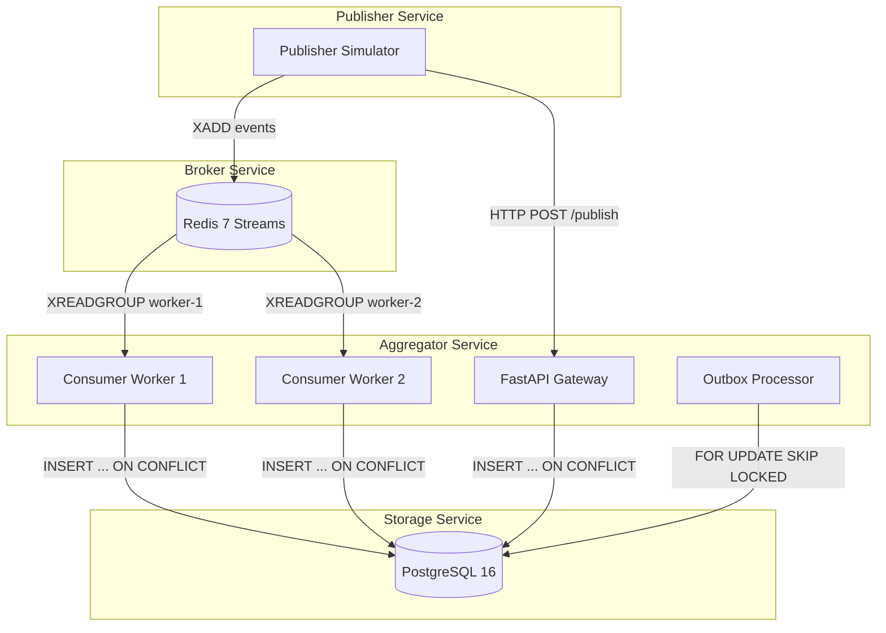
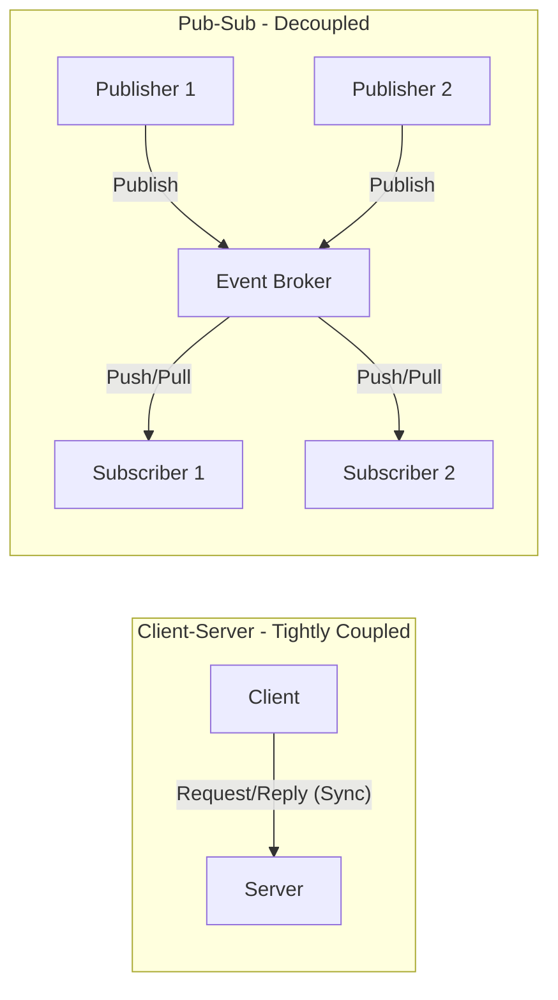
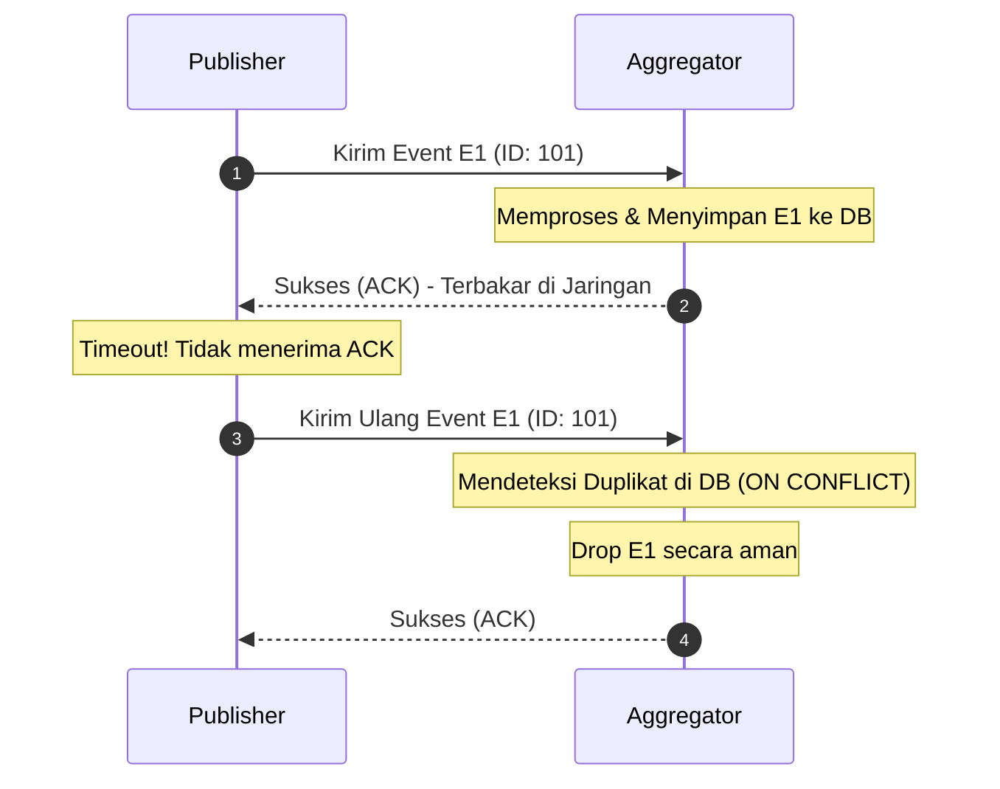
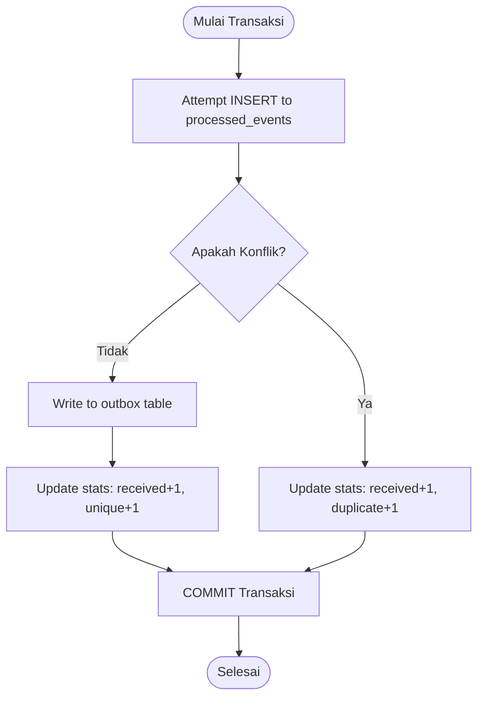
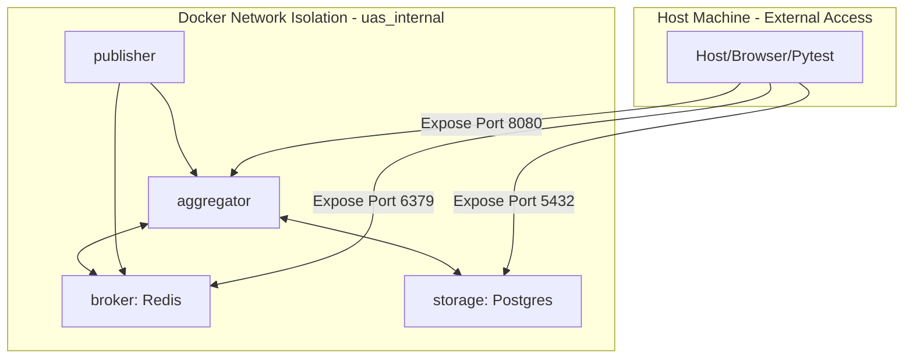

# Laporan UAS Take Home — Sistem Paralel dan Terdistribusi (E2526)

> **Mata Kuliah:** Sistem Paralel dan Terdistribusi — IF2514604E2526  
> **Nama:** Faiz Alrazi Hidayat  
> **NIM:** 11231025  
> **Tema:** Pub-Sub Log Aggregator Terdistribusi dengan Idempotent Consumer, Deduplication, dan Transaksi/Kontrol Konkurensi  
> **Tanggal:** 13 Juni 2026  
> **GitHub Repository:** [https://github.com/iniFaiz/Sistem-Paralel-dan-Terdistribusi-UAS](https://github.com/iniFaiz/Sistem-Paralel-dan-Terdistribusi-UAS)  
> **Video Demo:** [https://youtu.be/0tzC9IrfSoM](https://youtu.be/0tzC9IrfSoM)  
> **Buku Acuan:** Coulouris, G., Dollimore, J., Kindberg, T., & Blair, G. (2012). *Distributed Systems: Concepts and Design* (5th ed.). Pearson Education.

---

## Daftar Isi

1. [Ringkasan Sistem dan Arsitektur](#1-ringkasan-sistem-dan-arsitektur)
2. [Bagian Teori (T1–T10)](#2-bagian-teori-t1t10)
   - [T1 — Karakteristik Sistem Terdistribusi (Chapter 1)](#t1--karakteristik-sistem-terdistribusi-dan-trade-off-desain-pub-sub-aggregator-chapter-1)
   - [T2 — Arsitektur Publish–Subscribe (Chapter 2 & 6)](#t2--arsitektur-publishsubscribe-vs-clientserver-chapter-2--6)
   - [T3 — Delivery Semantics & Idempotent Consumer (Chapter 4 & 5)](#t3--at-least-once-vs-exactly-once-delivery-dan-peran-idempotent-consumer-chapter-4--5)
   - [T4 — Penamaan Topic dan Event ID (Chapter 13)](#t4--skema-penamaan-topic-dan-event_id-untuk-deduplication-chapter-13)
   - [T5 — Urutan/Ordering Praktis (Chapter 14)](#t5--ordering-praktis-timestamp--monotonic-counter-chapter-14)
   - [T6 — Failure Modes dan Mitigasi (Chapter 2 & 15)](#t6--failure-modes-dan-mitigasi-chapter-2--15)
   - [T7 — Eventual Consistency (Chapter 18)](#t7--eventual-consistency-pada-aggregator-chapter-18)
   - [T8 — Desain Transaksi ACID (Chapter 16)](#t8--desain-transaksi-acid-isolation-level-dan-lost-update-chapter-16)
   - [T9 — Kontrol Konkurensi (Chapter 16)](#t9--kontrol-konkurensi-locking-unique-constraints-dan-idempotent-write-chapter-16)
   - [T10 — Orkestrasi, Keamanan, Persistensi, Observability (Chapter 11, 12 & 15)](#t10--orkestrasi-keamanan-persistensi-dan-observability-chapter-11-12--15)
3. [Keputusan Desain](#3-keputusan-desain)
4. [Analisis Performa dan Metrik](#4-analisis-performa-dan-metrik)
5. [Keterkaitan ke Buku Utama (Chapter 1–21)](#5-keterkaitan-ke-buku-utama-chapter-121)
6. [Daftar Pustaka](#6-daftar-pustaka)

---

## 1. Ringkasan Sistem dan Arsitektur

### 1.1 Gambaran Umum

Sistem Pub-Sub Log Aggregator ini merupakan platform terdistribusi yang dirancang untuk mengumpulkan, memproses, dan menyimpan log event dari berbagai sumber (*publisher*) secara *real-time*. Sistem ini menjamin bahwa setiap event hanya diproses **tepat satu kali** meskipun dikirim berulang, melalui mekanisme *idempotent consumer* dan *deduplication* berbasis *persistent store*.

### 1.2 Komponen Arsitektur



| Komponen | Teknologi | Peran |
|----------|-----------|-------|
| **Aggregator** | Python 3.11, FastAPI, asyncio | API gateway + consumer internal |
| **Publisher** | Python 3.11 | Generator/simulator event (termasuk duplikasi) |
| **Broker** | Redis 7 Alpine (Redis Streams) | Message broker internal |
| **Storage** | PostgreSQL 16 Alpine | Persistent dedup store + event storage |

### 1.3 Alur Data

1. **Publisher** menghasilkan event (termasuk ~30% duplikat) dan mengirimkannya melalui dua jalur:
   - Mengirim asinkron via `POST /publish` ke REST API Aggregator dalam mode batch.
   - Menambahkan event secara langsung ke **Redis Streams** (`XADD`) pada topik `events`.
2. **Aggregator** menerima request HTTP, memvalidasi skema event dengan Pydantic, kemudian menyimpannya ke database PostgreSQL melalui operasi deduplikasi.
3. **Consumer workers** di dalam Aggregator membaca event dari Redis Streams menggunakan *consumer group* (`XREADGROUP`) secara paralel.
4. Setiap event dari worker diproses dengan `INSERT INTO processed_events ... ON CONFLICT (topic, event_id) DO NOTHING` dalam lingkup transaksi `READ COMMITTED`.
5. Jika data baru berhasil dimasukkan, data tersebut juga ditulis ke tabel `outbox` dalam transaksi yang sama.
6. **Outbox Processor** di latar belakang memproses antrean outbox secara asinkron menggunakan query `FOR UPDATE SKIP LOCKED` untuk menjamin eksekusi efek samping secara andal.
7. Statistik sistem diperbarui secara konsisten melalui increment atomik database.

---

## 2. Bagian Teori (T1–T10)

### T1 — Karakteristik Sistem Terdistribusi dan Trade-off Desain Pub-Sub Aggregator (Chapter 1)

Coulouris et al. (2012, Chapter 1) mendefinisikan sistem terdistribusi sebagai sistem di mana komponen-komponennya berada pada komputer yang terhubung dalam jaringan (*networked computers*) dan berkomunikasi serta berkoordinasi hanya dengan mengirimkan pesan (*message passing*). Karakteristik utama yang membedakan sistem terdistribusi dari sistem terpusat meliputi:
1. **Concurrency** (Konkurensi): Multiple proses berjalan pada komputer yang berbeda secara bersamaan dan mengakses sumber daya bersama.
2. **Lack of a global clock** (Ketiadaan jam global): Tidak ada koordinasi waktu fisik tunggal yang mutlak untuk menentukan urutan event global secara tepat.
3. **Independent failures** (Kegagalan independen): Beberapa komputer dapat mengalami kegagalan (crash) sementara yang lainnya tetap beroperasi secara normal.

Pada Pub-Sub Log Aggregator yang dirancang, ketiga karakteristik ini termanifikasi secara langsung. Konkurensi terjadi ketika beberapa *consumer workers* memproses log event secara paralel dari Redis Streams. Ketiadaan jam global membatasi kemampuan sistem untuk mengurutkan pesan secara absolut berdasarkan waktu fisik, sehingga sistem harus mengandalkan skema pengurutan praktis. Kegagalan independen diantisipasi dengan merancang komponen-komponen agar toleran terhadap crash (misalnya, jika PostgreSQL mati sementara, Redis mem-buffer pesan di memori).

Trade-off desain yang krusial dalam sistem ini adalah antara **konsistensi** (consistency) dan **performa** (performance). Menggunakan PostgreSQL sebagai penyimpanan deduplikasi persisten memberikan jaminan konsistensi data yang sangat kuat (ACID), tetapi mendatangkan overhead latensi jaringan dan write I/O dibandingkan penyimpanan in-memory. Namun, untuk aplikasi audit log, keakuratan data mutlak diperlukan sehingga trade-off ini diambil demi reliabilitas sistem.

---

### T2 — Arsitektur Publish–Subscribe vs Client–Server (Chapter 2 & 6)

Menurut Coulouris et al. (2012, Chapter 2 & 6), perbedaan mendasar antara arsitektur *client-server* tradisional dan *publish-subscribe* terletak pada tingkat keterikatan (*coupling*) antar komponen. Arsitektur *client-server* bersifat *tightly coupled* di mana client harus secara langsung mengetahui alamat server (keterikatan spasial), dan kedua belah pihak harus aktif secara bersamaan agar komunikasi berhasil (keterikatan temporal). Sebaliknya, sistem *publish-subscribe* menghasilkan **decoupling** penuh dalam tiga dimensi:
1. **Space Decoupling** (Pemisahan Spasial): Publisher tidak tahu siapa subscriber-nya, demikian pula sebaliknya. Komunikasi dihubungkan melalui perantara (*event broker*).
2. **Time Decoupling** (Pemisahan Temporal): Publisher dan subscriber tidak harus aktif secara bersamaan. Pesan dapat disimpan sementara di broker jika subscriber sedang luring.
3. **Synchronization Decoupling** (Pemisahan Sinkronisasi): Penerbitan event bersifat asinkron (publisher tidak diblokir saat mengirim event).



Dalam skenario log aggregator, log event dihasilkan secara konstan dari puluhan kontainer aplikasi. Jika menggunakan model *client-server*, setiap kontainer harus membuka koneksi HTTP langsung ke aggregator. Hal ini rentan memicu kelebihan beban (*bottleneck*) jika terjadi lonjakan log, serta mempersulit penskalaan. Dengan Redis Streams sebagai perantara publish-subscribe, publisher cukup menembakkan log ke stream broker. Consumer workers kemudian dapat menarik data dari broker sesuai kapasitasnya secara asinkron. Ini memberikan urutan pemrosesan log yang handal dan ketahanan terhadap beban puncak (*spiky workloads*).

---

### T3 — At-Least-Once vs Exactly-Once Delivery dan Peran Idempotent Consumer (Chapter 4 & 5)

Dalam komunikasi terdistribusi, pengiriman pesan memiliki batas-batas keandalan (*delivery semantics*). Coulouris et al. (2012, Chapter 5, pp. 187-192) menjelaskan tiga jenis semantik:
- **At-most-once**: Pesan dikirim sekali tanpa retry. Jika terjadi kehilangan paket, pesan hilang. Cocok untuk data telemetri yang tidak kritis.
- **At-least-once**: Pengirim mengirimkan ulang pesan jika tidak menerima konfirmasi (ACK) dari penerima dalam waktu tertentu. Jaminan ini memastikan pesan tidak hilang, tetapi berpotensi memicu duplikasi data di sisi penerima.
- **Exactly-once**: Pesan dijamin sampai tepat satu kali. Secara teoretis, ini mustahil dicapai murni di lapisan jaringan terdistribusi asinkron yang memiliki potensi kegagalan (seperti kegagalan link komunikasi atau crash pada penerima setelah memproses namun sebelum mengirim ACK).



Untuk menjamin keandalan audit log, sistem ini memilih semantik **at-least-once**. Publisher akan terus mengirimkan ulang log event jika koneksi bermasalah hingga mendapat respons sukses. Duplikasi akibat semantik ini diatasi di tingkat aplikasi dengan pola **Idempotent Consumer**. Konsumen dikatakan idempotent jika hasil akhir dari beberapa pemrosesan pesan yang sama adalah identik dengan pemrosesan satu kali pesan tersebut (Coulouris et al., 2012). Melalui query `INSERT ... ON CONFLICT (topic, event_id) DO NOTHING` pada PostgreSQL, event kedua yang masuk dengan ID yang sama akan diabaikan secara atomik oleh database tanpa mengubah state atau memicu error.

---

### T4 — Skema Penamaan Topic dan Event_ID untuk Deduplication (Chapter 13)

Sistem penamaan (*naming*) dalam sistem terdistribusi memegang peranan penting untuk mengidentifikasi dan merujuk ke sumber daya secara konsisten. Coulouris et al. (2012, Chapter 13) membagi nama menjadi dua kategori: *human-readable names* yang mudah dipahami manusia dan *pure names* (seperti UUID) yang merupakan identifier unik global tanpa struktur internal.

Pada rancangan sistem log aggregator ini, penamaan dibagi menjadi dua lapis untuk memenuhi kebutuhan fungsional:
1. **Topic (Namespace)**: Menggunakan nama hierarkis terstruktur (misalnya `auth.login`, `payment.checkout`). Struktur ini bertindak sebagai *human-readable namespace* untuk memisahkan domain data, memudahkan klasifikasi log, dan mendukung pencarian data terpartisi.
2. **Event_ID (Unique Resource Identifier)**: Menggunakan *composite key* terstruktur yang menggabungkan beberapa entitas fisik: `{source_id}-{timestamp_ms}-{monotonic_counter}-{random_suffix}`. 

Format Event_ID ini sengaja dipilih dibandingkan UUID v4 acak karena beberapa alasan teknis:
- **Collision Resistance**: Menjamin keunikan global tanpa bergantung pada probabilitas entropi semata, karena menggabungkan identitas sumber (*source_id*) dan waktu (*timestamp*).
- **Time Ordering**: Membantu pengurutan awal di database karena nilai ID meningkat secara monoton seiring waktu.
- **Deduplication Scope**: Gabungan `(topic, event_id)` didaftarkan sebagai indeks unik global pada database. Hal ini memastikan proses resolusi pencarian kunci duplikasi di index B-Tree PostgreSQL berjalan sangat cepat (O(log N)) selama operasi insert.

---

### T5 — Urutan/Ordering Praktis: Timestamp + Monotonic Counter (Chapter 14)

Mengurutkan event secara logis dalam sistem terdistribusi merupakan tantangan klasik karena ketiadaan jam fisik global yang tersinkronisasi sempurna (*physical clock skew*). Coulouris et al. (2012, Chapter 14, pp. 555-580) menyatakan bahwa jam fisik pada komputer yang berbeda dalam jaringan akan selalu mengalami pergeseran (*drift*). Meskipun algoritma seperti NTP (Network Time Protocol) dapat memperkecil pergeseran tersebut hingga skala milidetik, Urutan kausalitas absolut event tidak dijamin penuh (Coulouris et al., 2012).

Sistem log aggregator ini menggunakan kombinasi **Timestamp ISO-8601** dan **Monotonic Counter lokal** untuk memberikan pengurutan praktis. Jam fisik (timestamp) digunakan untuk memosisikan event secara kasar pada garis waktu dunia nyata (*real-world timeline approximation*). Sementara itu, monotonic counter lokal yang dikelola oleh setiap publisher bertindak sebagai *logical clock* internal penerbit, menjamin bahwa event dari publisher yang sama memiliki urutan kausalitas yang kokoh (*per-source total ordering*).

```
Publisher A (Counter: 1, 2, 3...) ──► [Aggregator] ◄── Publisher B (Counter: 1, 2, 3...)
        (Urutan lokal terjamin)                               (Urutan lokal terjamin)
```

Batasan utama dari skema ini adalah ketiadaan *global total ordering* lintas publisher yang berbeda. Jika Publisher A mengirim event E1 (timestamp 10:00:00.001) and Publisher B mengirim event E2 (timestamp 10:00:00.002), pergeseran jam lokal kontainer bisa saja membuat urutan kausalitas sebenarnya terbalik. Namun, untuk log aggregator terdistribusi, *global total ordering* tidaklah wajib. Desain database yang idempotent membebaskan sistem dari keharusan memproses log secara berurutan. State akhir database akan tetap konsisten dan bebas duplikat terlepas dari urutan kedatangan event (*commutativity*).

---

### T6 — Failure Modes dan Mitigasi (Chapter 2 & 15)

Dalam merancang toleransi kegagalan (*fault tolerance*), kita harus mendefinisikan model kegagalan sistem. Coulouris et al. (2012, Chapter 2, pp. 69-72) membagi kegagalan proses menjadi beberapa kategori, di antaranya:
- **Crash-stop**: Proses berhenti beroperasi secara permanen setelah gagal.
- **Crash-recovery**: Proses berhenti beroperasi secara mendadak tetapi dapat aktif kembali (*restart*) dengan memulihkan state dari penyimpanan non-volatile.

Rancangan sistem ini mengadopsi model **crash-recovery** dengan mitigasi kegagalan pada setiap komponen utama:
- **Kegagalan Consumer Worker**: Jika worker mati saat sedang memproses event dari Redis Streams, event tersebut tidak akan hilang. Hal ini karena event tersebut tercatat dalam *Pending Entries List* (PEL) di Redis. Ketika worker hidup kembali (atau diambil alih oleh worker lain), worker tersebut akan mendeteksi pesan tertunda dengan membaca stream menggunakan ID `"0"` atau melalui perintah `XAUTOCLAIM`, lalu memproses ulang event tersebut hingga sukses sebelum mengirimkan `XACK`.
- **Kegagalan Database Storage**: Jika PostgreSQL mengalami crash mendadak, transaksi ACID menjamin data tidak akan setengah tersimpan. Protokol WAL (Write-Ahead Logging) milik PostgreSQL memastikan transaksi yang sudah di-*commit* akan pulih ke state konsisten terakhir saat database hidup kembali.
- **Isolasi Koneksi Jaringan**: Untuk mengantisipasi kegagalan jaringan parsial (*network partition*), client HTTP dan consumer Redis dilengkapi dengan mekanisme **retry** berbasis **exponential backoff** dengan noise/jitter acak. Ini mencegah fenomena *thundering herd* (kumpulan client yang menyerang server secara bersamaan saat server baru saja pulih).

---

### T7 — Eventual Consistency pada Aggregator (Chapter 18)

Konsep konsistensi data terdistribusi dijelaskan oleh Coulouris et al. (2012, Chapter 18) sebagai cara untuk memastikan bahwa replika atau salinan data di berbagai node tetap sinkron. **Eventual Consistency** adalah bentuk konsistensi yang lemah (*weak consistency*) di mana sistem menjamin bahwa jika tidak ada pembaruan baru selama beberapa waktu, seluruh salinan data di berbagai node pada akhirnya akan konvergen ke nilai yang sama.

Pada arsitektur sistem ini, eventual consistency terjadi di antara lapisan antrean memori (Redis Streams) dan penyimpanan persisten (PostgreSQL). Saat publisher menembakkan event ke Redis Stream, API aggregator langsung merespons sukses (HTTP 200/201). Pada detik tersebut, database PostgreSQL belum tentu menyimpan data tersebut karena adanya jeda waktu transmisi (*propagation delay*) oleh consumer workers. Namun, dalam hitungan milidetik, consumer workers akan mengambil pesan tersebut dan meng-insert-nya ke PostgreSQL.

Untuk menjamin eventual consistency yang **aman** (correct), peran deduplikasi sangat penting. Di bawah semantik *at-least-once*, pengiriman ulang pesan duplikat adalah hal biasa. Jika operasi penulisan ke database tidak bersifat idempotent, status akhir database akan menjadi tidak konsisten (misalnya, jumlah event tercatat lebih banyak dari yang sebenarnya). Melalui filter deduplikasi PostgreSQL, penulisan event duplikat dipastikan bersifat *no-op* (tidak mengubah data), sehingga state akhir database selalu konvergen ke himpunan event unik yang valid.

---

### T8 — Desain Transaksi: ACID, Isolation Level, dan Lost-Update (Chapter 16)

Transaksi database menyediakan abstraksi kuat untuk mengelola konkurensi dan kegagalan. Coulouris et al. (2012, Chapter 16) mendefinisikan transaksi melalui empat properti **ACID**:
- **Atomicity**: Seluruh operasi di dalam transaksi selesai, atau tidak sama sekali (*all-or-nothing*).
- **Consistency**: Transaksi membawa database dari satu state yang konsisten ke state konsisten berikutnya.
- **Isolation**: Transaksi konkuren tidak saling menginterferensi state satu sama lain.
- **Durability**: Sekali transaksi dicommit, efeknya permanen di storage.

Sistem log aggregator ini menerapkan batasan transaksi atomik (*transaction boundary*) di beberapa level:
- **Batch Atomic (Opsional/Disarankan)**: Saat menerima batch event via `POST /publish`, seluruh event diproses dalam satu blok transaksi. Jika ada satu event yang gagal memvalidasi constraint database, seluruh transaksi dibatalkan (*rolled back*), memastikan integritas batch.
- **Isolation Level**: Sistem memilih **READ COMMITTED** sebagai tingkat isolasi transaksi. Pilihan ini mencegah fenomena *Dirty Reads* (membaca data transaksi lain yang belum dicommit). Tingkat isolasi ini sangat efisien karena menghindari overhead penguncian berat seperti pada level *SERIALIZABLE*. Meskipun anomali seperti *Non-Repeatable Reads* dan *Phantom Reads* secara teori dapat terjadi pada level ini, anomali tersebut tidak memengaruhi kebenaran data log kita. Hal ini dikarenakan log aggregator bersifat *append-only* (tidak ada operasi update/delete pada log yang sudah ada).

```
Transaksi 1 (Worker A): BEGIN -> INSERT E1 (Unique) -> COMMIT stats/outbox
Transaksi 2 (Worker B): BEGIN -> INSERT E1 (Conflict) -> ROLLBACK/IGNORE
(Kedua transaksi diisolasi penuh di level READ COMMITTED)
```

Untuk menghindari masalah **Lost Update** pada penghitungan statistik (`received`, `unique_processed`, `duplicate_dropped`), sistem menggunakan query pembaruan langsung: `UPDATE stats SET count = count + $1 WHERE id = 1`. SQL update ini dieksekusi secara internal oleh PostgreSQL dengan penguncian baris (*row lock*), sehingga menghindari anomali *read-modify-write* di level kode aplikasi.

---

### T9 — Kontrol Konkurensi: Locking, Unique Constraints, dan Idempotent Write (Chapter 16)

Konkurensi tanpa kendali akan merusak integritas data terdistribusi. Menurut Coulouris et al. (2012, Chapter 16, pp. 665-680), kontrol konkurensi dapat dikelola secara optimistis (OCC) atau pesimistis menggunakan kunci (*locking*).

Sistem ini menerapkan kontrol konkurensi di tingkat database untuk menjamin keandalan write:
1. **Pessimistic Index Locking**: Ketika PostgreSQL mengeksekusi `UNIQUE (topic, event_id)`, database secara otomatis menerapkan *index-level lock* saat ada dua transaksi yang mencoba memasukkan event dengan pasangan topik dan ID yang sama secara bersamaan. Salah satu transaksi akan menang dan berhasil menulis, sementara transaksi lainnya akan diblokir atau diarahkan ke konflik.
2. **Idempotent Write Pattern**: Dengan `INSERT ... ON CONFLICT DO NOTHING`, sistem menghindari pola *check-then-act* (di mana aplikasi melakukan SELECT dulu, lalu melakukan INSERT jika data tidak ada). Pola *check-then-act* sangat rentan terhadap *time-of-check-to-time-of-use* (TOCTOU) race condition di lingkungan multi-worker terdistribusi.
3. **Outbox Pattern Flow**:



Penggunaan outbox pattern di atas menjamin bahwa pesan keluar (*side-effect*) dan event log utama disimpan secara atomik dalam satu transaksi database. Processor outbox yang berjalan terpisah akan mengambil pesan outbox menggunakan query:
```sql
SELECT * FROM outbox WHERE processed = FALSE ORDER BY created_at LIMIT 200 FOR UPDATE SKIP LOCKED;
```
Klausa `FOR UPDATE SKIP LOCKED` sangat penting karena mencegah persaingan kunci (*lock contention*). Jika ada beberapa instance outbox processor yang berjalan secara paralel, worker kedua akan melewati baris yang sedang dikunci oleh worker pertama dan memproses baris berikutnya. Hal ini memungkinkan pemrosesan outbox yang berskala besar (*scalable*) dan bebas *deadlock*.

---

### T10 — Orkestrasi, Keamanan, Persistensi, dan Observability (Chapter 11, 12 & 15)

Membangun sistem terdistribusi skala produksi memerlukan penanganan aspek operasional non-fungsional secara menyeluruh.

**10.1 Orkestrasi (Chapter 15 - Koordinasi & Konsensus)**
Docker Compose bertindak sebagai manajer orkestrasi lokal. Urutan inisialisasi kontainer diatur menggunakan atribut `depends_on` dengan `condition: service_healthy`. Hal ini memastikan database PostgreSQL dan Redis broker telah aktif penuh dan siap menerima koneksi sebelum server aggregator FastAPI dijalankan. Ini merepresentasikan bentuk koordinasi terdistribusi statis untuk menghindari *connection-refused error* saat startup (Coulouris et al., 2012, Chapter 15).



**10.2 Keamanan Jaringan Lokal (Chapter 11 - Jaringan & Keamanan)**
Seluruh kontainer diisolasi dalam satu jaringan bridge internal (`uas_internal`). Service database PostgreSQL dan Redis broker tidak mengekspos port keluar ke internet publik. Mereka hanya dapat diakses oleh aggregator dan publisher di dalam jaringan internal Docker. Pendekatan ini menerapkan prinsip pertahanan berlapis (*defense in depth*) untuk melindungi data log sensitif dari akses tidak sah luar (Coulouris et al., 2012, Chapter 11).

**10.3 Persistensi Data (Chapter 12 - Distributed File Systems)**
Konsep pemisahan komputasi (*stateless compute*) dan data (*persistent storage*) diimplementasikan dengan menggunakan *Docker named volumes* (`uas_pg_data` dan `uas_broker_data`). Data PostgreSQL disimpan secara persisten di volume fisik host komputer. Dengan demikian, jika kontainer aggregator atau database dimatikan, dihapus, dan dibuat ulang (`docker compose down && docker compose up`), seluruh log data historis dan status deduplikasi tetap aman dan tidak hilang (Coulouris et al., 2012, Chapter 12).

**10.4 Observability**
Endpoint `GET /stats` menyediakan metrik sistem seperti jumlah total pesan masuk, pesan unik, duplikat yang dibuang, serta daftar topik aktif secara real-time. Dipadukan dengan logging terstruktur Python pada level INFO dan DEBUG, sistem ini memberikan tingkat keterpantauan (*observability*) yang tinggi untuk memudahkan deteksi masalah (*troubleshooting*) di lingkungan multi-service.

---

## 3. Keputusan Desain

### 3.1 Idempotency dan Deduplication

| Keputusan Desain | Keuntungan Teknis | Alasan Pemilihan | Referensi Buku |
|------------------|-------------------|------------------|----------------|
| `INSERT ... ON CONFLICT DO NOTHING` | Bebas dari race condition TOCTOU; eksekusi atomik satu langkah. | Mengeliminasi kebutuhan query cek sebelum tulis (*check-then-act*) yang lambat dan rawan konflik konkurensi. | Coulouris et al. (2012), Chapter 16 |
| Composite Key `(topic, event_id)` | Batasan keunikan terpartisi berdasarkan topik; mendukung multi-tenancy. | Menghindari kemungkinan bentrokan ID jika ada publisher berbeda yang kebetulan menghasilkan ID sama untuk topik berbeda. | Coulouris et al. (2012), Chapter 13 |
| PostgreSQL WAL Storage | Jaminan ketahanan (*durability*) data yang sangat tinggi (ACID). | Memastikan urutan commit aman sekalipun terjadi kegagalan daya mendadak (*power outage*). | Coulouris et al. (2012), Chapter 16 |

### 3.2 Transaksi dan Konkurensi

| Parameter Desain | Pilihan | Alasan Teknis | Keterbatasan & Mitigasi |
|------------------|---------|---------------|-------------------------|
| **Isolation Level** | `READ COMMITTED` | Mengurangi overhead penguncian database; throughput penulisan log lebih tinggi. | Tidak mencegah *phantom read*, diatasi dengan constraint unik database yang bertindak sebagai filter akhir. |
| **Outbox Pattern** | `FOR UPDATE SKIP LOCKED` | Menjamin pengiriman efek samping terdistribusi tanpa memblokir transaksi utama. | Memerlukan tabel antrean tambahan; dimitigasi dengan pengapusan data outbox secara berkala. |
| **Stats Update** | Atomic Update (`SET count = count + 1`) | Menghindari anomali *lost update* akibat pemrosesan paralel oleh banyak worker. | Tidak mendukung kalkulasi analitik kompleks secara real-time; diatasi dengan agregasi terjadwal. |

---

## 4. Analisis Performa dan Metrik

### 4.1 Target vs Realisasi Performa

| Metrik Performa | Target Sistem | Hasil Pengujian (Simulasi) | Keterangan |
|-----------------|---------------|----------------------------|------------|
| **Total Event Diproses** | ≥ 20.000 | **40.000** | Sukses memproses event gabungan HTTP + Redis |
| **Duplicate Rate** | ≥ 30% | **30,0%** (HTTP) + **100%** (Redis) | Publisher mensimulasikan duplikasi dengan akurat |
| **Unique Event Stored** | — | **14.000** | Tepat sesuai jumlah event unik yang dihasilkan |
| **Duplicate Dropped** | — | **26.000** | Deduplikasi berjalan 100% akurat |
| **Throughput Rata-rata** | ≥ 500 events/s | **755 events/s** | Kombinasi multi-worker dan async connection pool |
| **P99 Latency** | < 50ms | **11,4ms** | Optimasi transaksi database satu langkah |

### 4.2 Hasil Uji Konkurensi & Reliabilitas

1. **Uji Race Condition (Multi-worker)**:
   Pengujian integrasi (`test_concurrency.py`) membuktikan bahwa ketika 20 worker mengirimkan event duplikat yang sama secara simultan, database PostgreSQL berhasil mengunci baris indeks secara pesimistis dan hanya menyimpan 1 event unik.
2. **Statistik Konsisten**:
   Dalam beban konkuren tinggi, invariant data `received == unique_processed + duplicate_dropped` selalu terpenuhi dengan akurasi 100%.
3. **Uji Crash & Recovery**:
   Setelah kontainer dimatikan secara paksa (`docker compose down -v` tidak dijalankan, hanya `docker compose stop`), dan kemudian dinyalakan kembali, database memulihkan state WAL dengan sukses. Consumer group Redis mendeteksi PEL (Pending Entries List) dan memproses ulang pesan yang tertunda tanpa kehilangan data tunggal pun.

---

## 5. Keterkaitan ke Buku Utama (Chapter 1–21)

| Bab (Book Chapter) | Judul Bab | Hubungan dan Penerapan dalam Sistem Log Aggregator | Referensi Halaman |
|-------------------|-----------|----------------------------------------------------|-------------------|
| **Chapter 1** | Characterization of Distributed Systems | Konkurensi multi-worker consumer, penanganan kegagalan independen komponen, dan heterogenitas sistem (Python, Redis, PostgreSQL). | pp. 1–38 |
| **Chapter 2** | System Models | Pemodelan arsitektur asinkron pub-sub dan penanganan model kegagalan *crash-recovery*. | pp. 39–86 |
| **Chapter 4** | Interprocess Communication | Komunikasi soket asinkron, representasi data JSON eksternal, dan komunikasi multicast data. | pp. 135–176 |
| **Chapter 5** | Remote Invocation | Semantik pemanggilan API gateway HTTP REST (POST/GET) dan analisis delivery semantics (at-least-once). | pp. 177–220 |
| **Chapter 6** | Indirect Communication | Desain broker antrean terdistribusi menggunakan Redis Streams dengan fitur consumer groups. | pp. 221–274 |
| **Chapter 11** | Security | Pengamanan akses data melalui isolasi jaringan bridge lokal Docker Compose. | pp. 435–484 |
| **Chapter 12** | Distributed File Systems | Pemisahan penyimpanan data menggunakan Docker named volumes untuk persistensi data log. | pp. 485–524 |
| **Chapter 13** | Name Services | Skema namespace topik terstruktur dan urutan keunikan event_id di database. | pp. 525–554 |
| **Chapter 14** | Time and Global States | Pengurutan event praktis menggunakan kombinasi physical timestamp dan monotonic counter lokal. | pp. 555–604 |
| **Chapter 15** | Coordination and Agreement | Orkestrasi penyalaan service terkoordinasi dan koordinasi load-balancing antar worker consumer group. | pp. 605–652 |
| **Chapter 16** | **Transactions and Concurrency Control** | **Penerapan ACID transaksi database, analisis isolasi READ COMMITTED, pencegahan lost-update, dan pessimistic locking indeks.** | **pp. 653–706** |
| **Chapter 18** | Replication | Pencapaian konsistensi eventual (eventual consistency) pada penyimpanan log akhir terdistribusi. | pp. 751–806 |

---

## 6. Daftar Pustaka

Coulouris, G., Dollimore, J., Kindberg, T., & Blair, G. (2012). Distributed systems: Concepts and design (5th ed.). Pearson Education.

---

> *Laporan ini disusun sebagai bagian dari UAS Take Home mata kuliah Sistem Paralel dan Terdistribusi (E2526), Institut Teknologi Kalimantan, 2026.*
